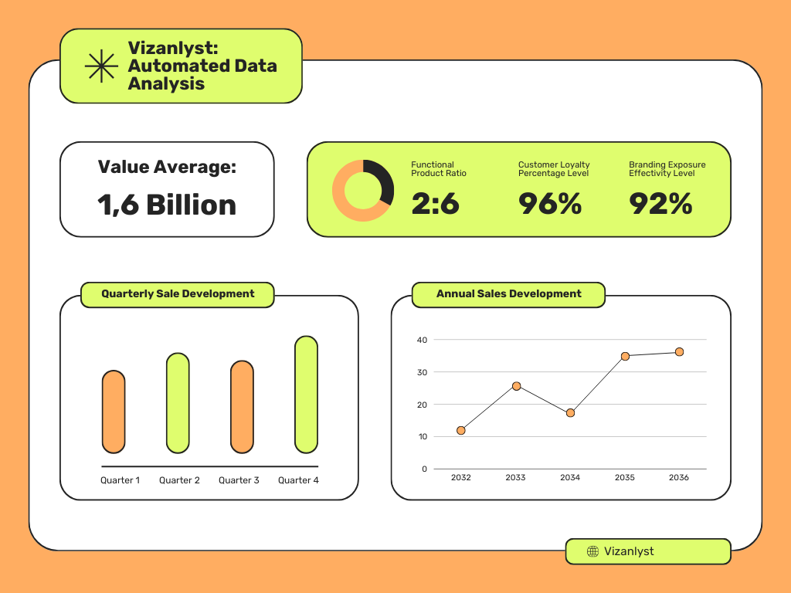

# Vizanlyst - Automated Data Analysis & Visualization

## 🚀 Overview
Vizanlyst is an AI-powered automated data analysis and visualization tool designed to help analysts, data scientists, and business professionals quickly generate insights from their datasets. With seamless integration with **Groq’s AI**, Vizanlyst automatically cleans, analyzes, and visualizes data, significantly reducing manual effort and saving valuable time.



## 🌍 Real-World Impact
Vizanlyst revolutionizes the way data is analyzed, making it accessible to professionals across industries. Here’s how it creates an impact:
- **Business Intelligence**: Enables executives to make data-driven decisions with instant insights.
- **Finance & Investment**: Helps financial analysts identify trends and patterns without extensive manual work.
- **Healthcare & Research**: Assists researchers in visualizing and interpreting large datasets for better medical insights.
- **Marketing & Sales**: Provides automated customer segmentation and trend analysis to optimize strategies.
- **Academia & Research**: Supports students and researchers in data analysis without requiring extensive coding knowledge.

## 🌟 Key Benefits
- **Automated Data Cleaning**: Handles missing values, duplicates, and outliers without manual intervention.
- **AI-Generated Visualizations**: Leverages **Groq’s AI** to create meaningful visualizations based on dataset insights.
- **Customizable Insights**: Users can ask for custom visualizations, making it a highly flexible analysis tool.
- **Auto-Generated Python Scripts**: Provides users with a ready-to-use Python script for further customization and reuse.
- **Time-Saving**: Eliminates the need for manual data processing, allowing professionals to focus on decision-making.
- **User-Friendly Interface**: Built with **Streamlit**, ensuring a smooth and interactive user experience.

## 📊 Features
### ✅ **Automated Analysis Flow**
1. **Upload a Dataset**: Supports CSV and Excel files.
2. **Data Cleaning & Preprocessing**: Removes duplicates, handles missing values, and prepares the dataset.
3. **AI-Powered Dashboard**: Displays key statistics, correlation heatmaps, and data distributions.
4. **Custom Visualizations**: Users can request specific visualizations based on their analysis needs.
5. **Python Code Generation**: Generates a unique script to replicate the entire process in Python.
6. **Downloadable Insights**: Users can export visualizations and Python scripts for further analysis.

## 🔧 Installation & Dependencies
To use Vizanlyst, install the required dependencies:
```sh
pip install streamlit pandas matplotlib seaborn groq
```
To run the application:
```sh
streamlit run app.py
```

## 📌 Dependencies
- **Python 3.7+**
- **Streamlit** (for UI)
- **Pandas** (for data handling)
- **Matplotlib & Seaborn** (for visualizations)
- **Groq API** (for AI-generated insights)

## 💡 How to Contribute
We welcome contributions! Here’s how you can help:
1. **Fork this Repository**: Click the fork button at the top of this repository.
2. **Clone Your Fork**:
    ```sh
    git clone https://github.com/your-username/vizanlyst.git
    ```
3. **Create a New Branch**:
    ```sh
    git checkout -b feature-name
    ```
4. **Make Your Changes** and **Commit**:
    ```sh
    git commit -m "Added new feature"
    ```
5. **Push the Changes**:
    ```sh
    git push origin feature-name
    ```
6. **Submit a Pull Request (PR)**: We’ll review and merge it!

## 🔄 Reuse & Customization
You can reuse and modify this project by setting up your own **Groq API Key** and customizing the dashboard layout.
Simply update the following section in **app.py**:
```python
st.sidebar.header("🔑 Enter Groq API Key")
groq_api_key = st.sidebar.text_input("API Key", type="password")
```

## 🛡️ License
This project is licensed under the **MIT License** – you are free to use, modify, and distribute it as per the terms of the license.

---

✨ Built with ❤️ by the Shreyas Dasari ✨

